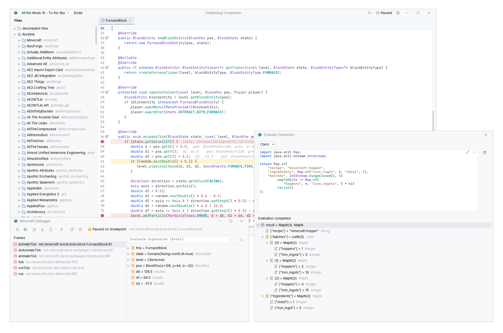

# TotalDebug Companion

A desktop source browser, Java scratchpad and debugger for [TotalDebug](https://github.com/Minecraft-TA/TotalDebug). Inspect the classes in your Minecraft instance, follow their references and experiment with the running game.



Minecraft source with an illustrated debugger pause and a nested Java evaluation result.

## Explore the runtime

Open a block, entity or item from Minecraft with F6, then navigate its decompiled source. Companion includes class and member search, Find Usages, type hierarchies, editor completion and archive resource previews.

The workspace remains open when Minecraft exits. Source browsing and indexed navigation work offline while the runtime archives and Java installation remain available. Live tools reconnect when TotalDebug starts again.

## Evaluate and debug

Evaluate expressions or Java statement bodies, inspect their results, and save reusable code as scripts. Run scripts on the client or server according to the server's execution policy.

The debugger provides breakpoints, stepping, stack frames, variables, watches and breakpoint actions. Paused evaluation uses the selected frame. Code that invokes methods or changes fields can affect Minecraft, and cancellation does not undo those effects.

See [usage and limitations](https://github.com/Minecraft-TA/TotalDebug/blob/1.21.1/docs/USAGE.md) for debugger attachment, supported evaluation contexts and cancellation behavior.

## Build and run

Companion requires **Windows x64 and a full JDK 21**. The application JAR contains its dependencies, but no Java runtime.

From the repository root, run these commands. The shared libraries build automatically. See [build instructions](../docs/BUILD_RELEASE.md) for checks and paired releases.

```powershell
.\gradlew.bat :companion:shadowJar
java -jar companion/build/libs/TotalDebugCompanion.jar
```

TotalDebug can launch the same JAR from Minecraft. Standalone startup reopens the last profile when one is available.

For UI changes, the test harness renders named states without a game session:

```powershell
.\gradlew.bat :companion:uiHarness '--args=--theme=islands-dark --scenario=search-results'
.\gradlew.bat :companion:uiHarness '--args=--list-scenarios'
.\gradlew.bat :companion:uiContactSheet
```

Contact sheets and individual captures are written under `companion/build/ui-screenshots`.

## Integrations and storage

The [MCP API](MCP.md) exposes source queries, Java execution and debugger operations to trusted local clients. The [storage guide](https://github.com/Minecraft-TA/TotalDebug/blob/1.21.1/docs/STORAGE.md) describes scripts, settings, persisted debugger state and generated caches.
