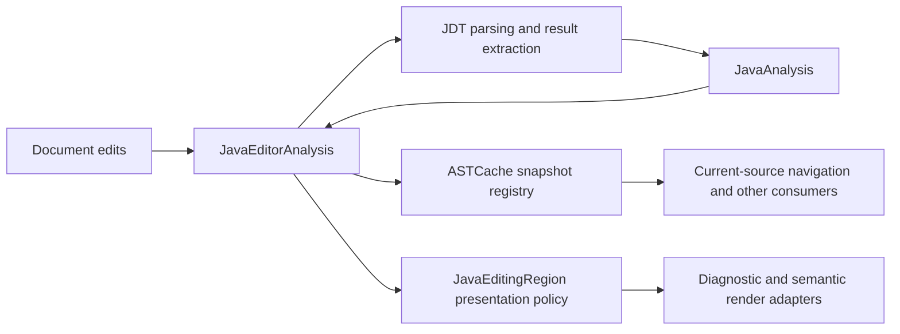

# Editor analysis and active-edit diagnostics

Implementation and regression audit, 2026-09-16/17. This document records the current contract and the architectural boundary. The earlier 400 ms diagnostic grace policy was incorrect and has been removed.

## User-visible contract

An expression being written is not ready for error feedback merely because typing paused. Error visibility follows editing actions, not elapsed time.

| Editing state | Expected display |
| --- | --- |
| `NeoForge.EVENT_BUS` being typed | No provisional expression error. |
| `NeoForge.EVENT_BUS.` with completion open | No red underline on the dot or receiver, even after parsing and a long pause. |
| A partially typed member | No unresolved-name error while that name is still being edited. |
| Editing `receiver.getCou` inside pre-existing `();` | Existing delimiters do not commit the edited name. |
| Completed bad assignment followed by an unfinished expression on the same line | The assignment stays red; the unfinished expression does not. |
| An established erroneous statement after the edited expression | Its diagnostic remains visible even if JDT recovery absorbs it into the unfinished expression. |
| Closing an inner call while outer arguments are unfinished | Continue deferring the active construct's errors. |
| Completing the edited call/statement or accepting a completed call | Release diagnostics for that part. Completion argument placeholders remain active editing. |
| Moving outside the edited part | Show its remaining errors. |
| Explicit run/compile | Show all current diagnostics; compilation itself always receives the complete source. |
| Moving the caret onto an existing error without editing | Do not hide it. |

Newlines in multiline expressions, punctuation inside strings/comments, pauses, and opening/browsing completion are not completion signals. Suppression is scoped to the active construct, not the entire caret line. This first implementation does not try to independently commit every subexpression within an unfinished statement.

## Architecture

One JavaEditorAnalysis instance owns a full Java editor's document revision, work admission, failure handling, accepted result, editing policy and EDT publication. AbstractCodeViewPanel creates and disposes it. ScriptPanel supplies explicit completion/run signals.

Normal edits coalesce at the end of the EDT turn. There is at most one running parse plus the latest requested revision per editor. No idle timer determines analysis admission or error visibility. A bounded window-owned executor performs parsing; closing an editor or replacing its analysis environment prevents queued work from starting where possible and rejects late publication. Unchanged environment notifications do not clear the display.

JavaAnalysis binds source, source map, AST, revision and environment with prepared diagnostics, semantic spans, declarations and statement bounds. The worker computes all derived data before publication. The snapshot record is not a deeply immutable JDT tree; consumers must not mutate it.

ASTCache is a registration/snapshot registry, with no parser scheduler or language-specific recovery policy. Events carry complete results. Edits revoke authoritative current access immediately; retained visual data cannot drive navigation or completion edits. Code vision, breadcrumbs, source navigation and debugger consumers use matching source/AST/map data. Runtime resource ownership remains with the existing runtime infrastructure.

CustomJavaParser only adapts accepted display notices to RSyntaxTextArea. CustomJavaTokenMaker keeps lexical decoration, edit-aware spans, lexical guards and Enter behavior. Its independent AST subscription was removed. The generic token API still supports JavaExpressionField's runtime debugger provider.

Completion and parameter-help requests keep their existing engines. Historical javac Problems remain tied to submitted source; this UI is intentionally separate from live JDT diagnostics. No evaluator, execution protocol or JIndex schema changes were needed for this work.

## Active editing policy

JavaEditingRegion is presentation-only state. It tracks the edited construct and the caret scope that commits it. For an identifier being changed within a completed statement, leaving that identifier commits it. For an unfinished expression, the caret can move within the construct without ending editing.

The existing lexer supplies structural boundaries where JDT drops unfinished syntax. It ignores punctuation inside comments and literals, balances parentheses/brackets, and treats semicolons inside for headers differently from statement endings. Fresh recovered AST statements can narrow the region. Newly typed code delimiters can commit an edit; delimiters already present in the document cannot.

Mapped statement bounds are collected during the existing worker AST traversal. On edits, untouched bounds shift; changed bounds are discarded. They prevent a trailing dot from extending suppression into an established following statement. When recovery distorts an untouched statement, its earlier display diagnostics survive until reliable analysis returns. Raw analysis is never rewritten or suppressed. Leaving editing or explicit compilation restores current raw diagnostics.

Deleting the first character of an adjacent statement must select that statement, not the preceding semicolon. Deleting an entire statement does not begin editing the unchanged statement that follows it. Deleting only a separator continues editing the surviving preceding statement. These cases have separate regressions.

A file first opened with broken syntax has no previous reliable neighboring-statement baseline. It initially displays current recoverable diagnostics normally; the design does not promise perfect continuity through arbitrary malformed Java without that history.

## Import warnings and semantic colors

JDT can skip unused-import analysis after mandatory errors. An unavailable pass is different from a successful pass reporting no warnings. Syntax-complete semantic-error cases reuse JDT's existing import pass. Forcing it through discarded syntax is unsafe: it can falsely mark EventBus and NeoForge unused.

JavaImportWarnings keeps the last checked unused-import warnings by declaration identity. Completion may replace an entire import block; unchanged declarations still recover their checked warning immediately in the same EDT turn. Breaking one import discards that declaration's warning, not the other imports' warnings.

Possible new uses come from lexical occurrences outside imports, comments and literals. Previously checked occurrences follow document edits; changing their enclosing statement invalidates their previous meaning. This distinguishes replacing a local named `Unused` with a type use from harmless Enter presses. A local map makes per-edit occurrence matching linear. JDT remains responsible for deciding actual import usage. Static and wildcard identities come from ImportDeclaration metadata.

JavaImports supplies the same prefix-import boundaries to warning presentation and JavaSnippetSource. It preserves incomplete imports in the generated header, without inserting missing semicolons or consuming following calls and declarations. Valid multiline/commented imports remain supported. This removes the former disagreement between the two import scanners.

Unchanged semantic spans follow edits and survive known recovery gaps. Fresh reliable classifications replace them. The lexer remains authoritative for strings, comments and token boundaries; provisional colors never become semantic truth.

## Why this was a redesign of coordination

The earlier implementation had several active owners:

- AbstractCodeViewPanel submitted a full AST parse on every document event.
- ASTCache scheduled work and emitted partial AST/version notifications.
- The token maker independently subscribed, validated freshness and published colors.
- ScriptPanel combined a diagnostic timer with forced edit and AST updates.

A source mismatch became an empty successful diagnostic result, producing the measured `1 -> 0 -> 1` notice sequence after inserting a harmless space. New code made that clearing immediate. Semantic colors were replaced wholesale even when JDT discarded a trailing-dot expression. A later ownership redesign fixed those transitions but incorrectly used 400 ms as permission to show active typing errors. Current code removes that timing policy and tests the actual visibility contract.

Removed mechanisms include the cache scheduler, split AST/text/map getters, partial notifications, ScriptPanel's forced edit/AST refresh paths, token-maker AST subscription, and tests requiring every edit to clear notices. There is one current implementation, not a compatibility pipeline.

The architecture audit did not find an abandoned second language engine or defensible dead top-level JDT class/function in its scoped reference inventory. At that audit, the JDT directory contained 67 files and 8,936 physical lines, with 28 active framework stub/implementation files accounting for 3,791 lines. Their size did not justify replacing JDT. This was a scoped reference inventory, not whole-program reachability proof or a promised deletion count.

## Verification

The production owner is tested with an ordinary RSyntaxTextArea and controlled executor. Tests drive document edits and observe both pending and completed-analysis states. ScriptCompletionDiagnosticsTest drives real JDT completion through ScriptPanel's actual completion acceptance, import mapping, snippet insertion, undo and redo. It checks warnings and semantic colors before the EDT yields to analysis and after publication. No fake cache entries are published.

The initial four active-edit acceptance tests failed in three cases against the previous implementation: trailing dot, partial name within existing delimiters, and same-line completed errors. They now pass without changing the raw diagnostic results.

Coverage includes:

- Active bare/dotted/partial expressions after analysis, multiline continuation, and caret departure.
- Completed same-line errors, erroneous following statements, adjacent deletion and separator deletion.
- Completion argument placeholders, nested call delimiters, literal punctuation, for headers and explicit run signals.
- Existing errors under the caret, first-open-invalid source, changed binding classifications, import first/last uses, static/wildcard imports, whitespace/comment boundaries, compound completion edits and undo/redo.
- Stable relocated underlines/tooltips, latest pending work, stale publication, close/reopen, environment replacement, failed/rejected work and recovery.
- AST registry revocation, stale link execution and runtime expression renderer compatibility.

The ATM10 Sky pack replay exercises EventBus private-field access and ItemStack in Islands dark/light themes without executing game code. It explicitly asserts zero ERROR notices on the active dot and partial name after analysis, including an additional 900 ms pause. Original import warnings and receiver colors must remain. Offscreen captures are under `companion/build/ui-screenshots/active-edit-*.png`. The disposable probe is `companion/build/diagnostic-audit/TypingWorkflowProbe.java`.

The same replay submits one parse for a 50-edit compound burst. Recorded EDT round trips were 35 ms dark and 18 ms light; these are local warm-run observations, not performance guarantees. Screenshots supplement state assertions and are not used alone to infer absence of flashing.

## Recording regression audit

The 2026-09-17 recording exposed gaps in the earlier 53-test verification. That suite did not cover actual completion import replacement or malformed import extraction. Its passing result did not establish the requested editing behavior.

The recording replay uses the installed ATM10 Sky index and actual GasData completion. Before these fixes, accepting completion changed seven unrelated import warnings to zero. Deleting the last import's semicolon also cleared every warning. Afterward, completion and `GasData.CODEC;` preserve seven warnings; the damaged import leaves the other six intact, both pending and settled.

Added regressions cover Enter at document start and across import/body lines, unchanged semantic colors, whole import block replacement, import-semicolon deletion, equal-count identifier role changes, and incomplete multiline imports before calls, arrays, generic declarations and other imports. Enter at offset zero also exposed and fixed an invalid negative document read.

The replay prototype and extracted recording frames are under ignored `companion/build/diagnostic-audit/`. Regression tests are checked-in source; temporary probes are not production paths.

Final focused validation: 93 tests pass, including a real paint assertion that warning-colored underline pixels are identical before Enter, while analysis is held pending, and after publication. The recording replay and EventBus/ItemStack replay pass against the ATM10 Sky index in both themes. No test window is shown.

The broader Companion suite ran 752 tests with two failures: an obsolete completion assertion expecting the caret before the semicolon, now corrected and passing in the focused run, and the previously observed FlatIconButtonTest focus-paint assertion. The full suite was not rerun after that test expectation and the added pixel test. Targeted independent reviews reported no remaining actionable issue in this fix. The warning occurrence lookup measured roughly 3–7 ms warm on a 29 KB synthetic script after replacing a quadratic comparison with a local map.

## Completion failure and transient error follow-up

A later report reproduced a separate completion failure with `((EventBus) NeoForge.EVENT_BUS).listeners.elements().as`. The same loaded pack returned results for `.a`, then threw from SubtypeCompletion.receiverExpression for `.as`. The temporary cast probe for ICU StringTokenizer returned a context without a completion node. A Java pattern switch's default arm does not handle null; the receiver extractor now explicitly accepts null as an unavailable probe. Direct suggestions survive.

The live Companion process showed that the selected popup proposal belonged to an older request. Request failure previously only logged the exception, leaving that stale list active and consuming Enter without applying anything. ScriptPanel now dismisses a failed current request, ignores obsolete failures, and carries Enter/Tab intent across a pending list refresh using the selected proposal identity. Dismissed refreshes cannot reopen the list or apply queued acceptance. Document edits invalidate requests even when the caret does not move. Applying a completion does not start nested completion requests, and its atomic edit always closes.

A separate failing regression showed the red flash: a hidden trailing-dot diagnostic survived insertion of a finished call, then became visible when the active editing region ended. An edit now discards provisional diagnostics from that previous unfinished source before committing the editing state. Current analysis still reports genuine completed-code errors.

The follow-up focused run passes 83 tests, including parameter-help coverage. ScriptCompletionPopupTest drives the real popup key listeners and real JDT proposals with controlled delivery, native visibility, and focus. It covers pending Enter, failed requests, later recovery, obsolete failures, Tab, Escape, forward Delete without caret movement, and the immediate diagnostic state after accepting a void call. These tests never show desktop windows. The exact chained pack completion, previous recording replay, and EventBus/ItemStack dark/light replays all pass. The full suite was not repeated for this follow-up.

## Postfix extraction and missing-type completion

`.var` now renders its full resolved type through the existing ImportRewrite machinery. The old one-level readable-name import collection was removed. Nested generic arguments, wildcard bounds, arrays and simple-name conflicts use the same import context as casts. CompletionTypes shares the existing capture-to-wildcard normalization between cast suggestions and extraction. A standalone captured wildcard value uses its upper bound because a wildcard alone is not a legal local-variable type.

Minecraft, NeoForge and Forge types share the same limited collision preference. JDT's generic Java-library bonus is neutralized only for equal simple names; explicit imports, expected types and qualified searches remain stronger signals.

The repeated `clear()` rows were different JDT recovery guesses for the unresolved EventListener argument. Global NameLookup searches had ignored the exact/partial distinction and returned names such as ChunkEventListener. Exact recovery searches now filter exact case-sensitive simple names. Legitimate alternative imports remain separate proposals, with the required type shown in the row instead of visually identical labels. In the ATM10 Sky replay, the manually broken example fell from 37 clear proposals to three explicit import alternatives. Successful `.var` extraction adds the NeoForge import and produces one clear proposal.

118 focused tests pass, including real Enter acceptance of `.var`, nested imports and selected rename text, subsequent diagnostics, wildcard values, array types, name conflicts, ranking, partial/exact lookup, completion presentation, existing cast completions, popup lifecycle, debugger completion and parameter help. The pack replay confirms the correct EventListener import and first-ranked NeoForge type. The missing-type popup was rendered offscreen at `companion/build/diagnostic-audit/missing-eventlistener.png`.

A separate synthetic `new Str` constructor-prefix probe returned no proposals under both the previous and current lookup implementation. This predates the exact-lookup correction and remains a separate investigation; ordinary partial type completion has regression coverage here.

## Reference editor syntax styles

The reference IDE uses Rider Islands syntax colours. The initial Companion palette mistakenly
copied standard Islands syntax values, where class references and ordinary text share a colour.
Inspection of the installed Rider Islands and OLED schemes confirmed their relevant syntax
attributes are identical; OLED was not the cause of the mismatch.

The editor palette now maps Rider's type, field, method, keyword, literal and comment values, with
corresponding light colours. Identifiers and punctuation have their own palette value. Static-final
fields have a distinct semantic token for bold constants; comments are italic and keywords remain
plain. The binding visitor and render styles are tested separately, including font resizing and
theme switching. The source-reference expression was rendered offscreen in both palettes under
`companion/build/diagnostic-audit/rider-syntax-*.png`. No Rider theme files or plugin assets were copied.

## Unresolved types within the edited statement

UndefinedType diagnostics remain visible when they refer to a different qualified name from the
one being edited. This keeps a missing EventListener import visible while the initializer ends in
a dot or partial member. Editing EventListener itself still defers that diagnostic. The existing
lexer identifies qualified-name bounds, including whitespace/comments around dots, so unfinished
`new Missing.` type expressions do not regress. Other unfinished-statement errors retain the
existing presentation policy.

Regressions cover pending and settled diagnostics, generic declarations, type-name edits and
backspacing, caret departure, and incomplete qualified types. The exact pack replay preserves
only `EventListener cannot be resolved to a type` while the initializer ends in `.ls`, then hides
it while that type name is being edited. No broader expression dependency analysis was added.
