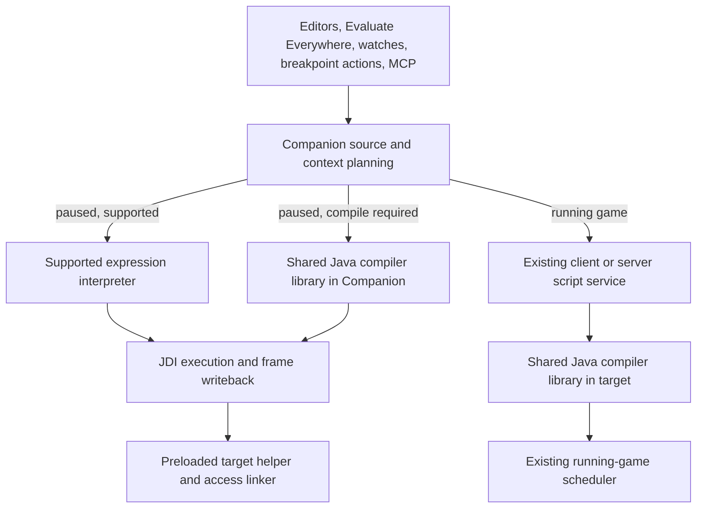

# Shared Java evaluation implementation plan

Status: implemented scope and verification notes, 2026-09-04. The original design below records the broader design goals; the supported implementation is summarized here.

Implemented: the shared compiler module; whole-tree expression preflight; receiver ordering and frame reacquisition; tracked evaluation with non-destructive waits and cancellation; MCP operation APIs and typed scalar results; compiled loops, declarations, constructors, imports and lambda capture in public named frame contexts; local writeback on success and exception; sequential watches and root previews with per-pause/frame watch results; Expression/Code plus paused-frame controls in Evaluate Everywhere; and inline or saved-script breakpoint actions with stay-paused defaults and explicit scalar-only continuation.

The compiled adapter is deliberately small and uses the existing javac/private-member transformer. It rejects inaccessible or unnamed frame types, ambiguous loader-specific classpath definitions, nested type declarations and lexical `super`. The JDT snippet compiler was investigated and rejected because it does not remove those limitations and has different private-access and lambda semantics.

The implementation retains the existing expression interpreter rather than adding a Java type checker. Its whole-tree preflight checks supported syntax; it does not establish full Java compile-time binding or overload parity. Compiled fragments receive javac validation before target invocation. The full private-type/loader/lexical-super feasibility gate and live Minecraft acceptance remain unverified. No deployment has been performed.

Breakpoint actions re-read saved source on each hit. They retain the latest result or error, run through the same evaluation owner, and remain paused on failure, cancellation, a slow operation, or changed breakpoint/stop state. Automatic continuation supports scalar results only. Objects remain paused and inspectable. MCP wait/cancel accepts operation IDs from manual evaluations, breakpoint actions, conditions and previews. Caller timeouts never release ownership of a still-running invocation.

Retention correction, 2026-09-05: evaluation results are pinned only while owned by bounded operation history, the latest breakpoint action or an inspector. Engine history and manual-operation history each retain at most 128 operations. Inspectors own their displayed and cached frame results until replacement, removal, close or pause expiry. Aliases share one object pin; the final owner releases it. Resume and detach invalidate every outstanding lease. These are live object references, not immutable snapshots or a byte-size limit on target graphs. Companion's 454-test build and the original 140-evaluation audit probe pass; current evidence is in [release progress](RELEASE_PROGRESS.md).

Verification: 420 Companion tests pass, including real JDWP child-JVM tests for receiver order, frame refresh, compiled loops and lambdas, writeback after exceptions, scalar/boxed/void results, saved-script reload, slow/cancelled actions, object-result expansion and array paging. The TotalDebug and shared-storage suites pass with 426 tests. The Evaluate Everywhere Code editor was rendered and inspected in both themes; the breakpoint action editor was rendered and inspected in the light theme.

Packaging correction, 2026-09-05: shared compiler and bridge classes now live in `com.github.minecraft_ta.totaldebug.evaluation`. The mod retains `com.github.minecraft_ta.totaldebug.script`. Sharing the latter package across the mod JAR and embedded library caused NeoForge's Java module resolution to fail during startup. `ModulePackagingTest` resolves the actual packaged mod and every embedded JAR together and runs with the regular test task. The test reproduced the split-package exception before the move and passes after it. Both applications must be rebuilt together because Companion names the preloaded bridge in the target.

Development state now uses format 2 for breakpoint actions and expression/body history. Existing format-1 state needs the documented manual development reset; no migration is included.

This plan follows the debugger, scripting, breakpoint-action, and Evaluate Everywhere discussion in [Plan Minecraft mod port](thread://01a0269a-7a11-7300-8a1e-8d657ae7ce71). It covers the complete feature, delivered in independently verifiable stages.

Inspected baseline: TotalDebug `24651c9`, Companion `3dd490c`, SCNet `802221b`, JIndex `80f8b43`. Existing unrelated workspace changes remain outside this plan. Repository roots are the four exact paths in [AGENTS.md](../AGENTS.md).

## 1. Outcome and fixed rules

Users can evaluate ordinary Java expressions and statement bodies in a running game or a selected paused frame. Saved scripts, Evaluate Everywhere, watches, debugger evaluation, and breakpoint actions share source handling and Java capabilities. Execution context determines available values, scheduling, and result lifetime.

- Keep the existing interpreter for expressions it can implement correctly. Compile other valid fragments using the existing Java compiler and private-access machinery.
- Select the engine before executing any part of the fragment. Never catch an execution failure and rerun through another engine.
- Timeouts and failures never detach, issue Continue, or retry. A requested invocation necessarily executes on its target thread, but is not permission to resume normal gameplay or other suspended threads.
- Distinguish ending a caller's wait from stopping execution. Track an invocation until it actually returns or the VM connection is lost.
- Preserve Java evaluation order, declared-type semantics, exceptions, and mutations. Do not claim rollback.
- Use runtime class identity and available frame metadata as authority. Fail with the exact missing requirement when a context cannot be represented.
- Retain live debugger references while paused. Running-game results remain captured values. Share presentation components without conflating those lifetimes.
- Keep one current implementation. Move shared code rather than copying it. No migration code, legacy adapters, or fallback for obsolete development state.

Project switching, direct remote-server debugging, modifying existing game classes, and a general automation/job framework are outside this work. Existing client/server script execution must continue working.

## 2. What exists and what must change

Paths in this table are relative to the named repository's Java package root.

| Area | Current path and behavior | Required change |
| --- | --- | --- |
| Interpreter | Companion `debugger/expression/JavaExpressionEvaluator` recursively evaluates a JDT expression AST | Separate planning from execution; fix receiver ordering, stale frame use, and verified semantic defects |
| Adapter integration | Companion `debugger/expression/RichJavaExpressionEngine` implements Microsoft evaluation/completion providers | Keep it as an adapter around shared planning and debugger execution ownership |
| Timeout | Companion `debugger/expression/DebuggerEvaluationRunner` detaches after five seconds and discards late completion | Replace destructive timeout with tracked execution and independent caller waits |
| Session coordination | Companion `debugger/DebuggerSessionController` joins evaluation futures on its serial command queue | Start long operations asynchronously; serialize admission and completion only |
| Compiler | TotalDebug `script/InMemoryJavaCompiler`, file manager, relaxed class input, transformer, linker | Extract reusable parts behind explicit classpath and target-access inputs |
| Running scripts | TotalDebug `script/ScriptRunner`, client/server script services and tick scheduler | Keep running-game scheduling and execution ownership here |
| Snippets | Companion `jdt/JavaSnippetSource` creates expression/body wrappers and source maps | Share the source model; add a separate paused-frame wrapper strategy |
| Evaluate Everywhere | Companion `ui/views/EvaluateExpressionWindow` uses expression mode and `SnippetExecutionService` | Support statement bodies and explicit running/paused context selection |
| Watches and previews | Companion debugger model, value tree and previewer | Coordinate target calls with all other evaluation, prevent implicit reruns |
| Breakpoints | Companion controller, `BreakpointsWindow`, `storage/InstanceState` | Add action definitions and explicit completion policy |
| MCP | Companion `mcp/DebuggerMcpService` and `DebuggerMcpToolCatalog` block for an evaluation and return formatted text values | Add pending operations, wait/cancel, consistent contexts and typed values |

The ordering bug is directly visible in `methodInvocation`: arguments are evaluated before the receiver. Unsupported nodes are rejected only when recursive execution reaches them. Both need regression tests before implementation changes. The previously observed static-field timeout still needs its own reproduction; changing timeout policy does not establish its cause.

## 3. Ownership and dependency direction

Add a Java 21 `:evaluation` library in TotalDebug, published locally as `totaldebug-evaluation` and consumed by both applications, following the existing shared-storage build arrangement.

The library owns the reusable compiler, generated-bytecode transformation, source/source-map contracts, diagnostics, and small generated-code runtime contracts. Separate compiler and target-runtime packages. Its public inputs are ordinary Java data and class-byte/type-resolution interfaces. It must not depend on Minecraft, NeoForge, Companion, Swing, JDI, SCNet, or native JIndex. Replace the compiler/transformer's existing `ScriptProgram.class` special cases with execution-profile metadata. Minecraft-aware `ScriptProgram` stays in the mod.

Keep runtime discovery, cache preparation, server authorization, tick scheduling and network routing in TotalDebug. Keep paused-frame discovery, semantic binding, JDI control, operation state and UI/MCP projection in Companion. Pass classpath information into the library; do not move `ScriptCompilerClasspath.discover()` and its `TotalDebug.get()` dependency into it.

Normal scripts continue to compile in the target that owns their runtime, including the existing server route. Paused fragments compile in Companion against prepared data. They never depend on an SCNet response, Minecraft tick, server task, or worker in the stopped VM to finish compilation.

SCNet remains transport. Its current message bus invokes listeners synchronously under its listener lock, so any new readiness/preparation listener must enqueue work and return. No evaluator policy belongs in SCNet. JIndex remains a browsing/completion aid; indexed names do not establish JVM loader identity or paused-local availability. No SCNet/JIndex API change is planned unless a focused test proves one is needed.

## 4. One source model, explicit execution contexts

Use an immutable request containing source text, imports, source mode, origin, and context. Proposed names are descriptive, not a requirement to create a class for every term.

- `JavaFragment`: expression or statement body plus imports and an editor source map.
- `RunningContext`: captured runtime-session identity, client/server side, existing scheduling choice.
- `PausedContext`: debugger-session generation, pause ID, selected thread/frame identity, lexical owner, and defining loader identity.
- `EvaluationPlan`: selected engine, bound inputs, required capabilities, source mapping, and planned writes. Planning must not invoke application code.
- `EvaluationOperation`: one admitted request, execution state, cancellation request, elapsed time, outcome and originating identity.
- `EvaluationOutcome`: success, failure or actual cancellation, with diagnostics, result, logs if available, and local-writeback status.

The UI offers Expression and Code modes. Expression mode returns the expression value. Code mode accepts statements and an explicit `return`; a body with no return produces a distinct no-result outcome. Keep `null`, `void`/no result, failure and pending separate. A source-mode decision is made during parsing, never by executing and retrying.

The compiler and editor use the same generated-source model and binding context. Completion and semantic highlighting must not execute getters or methods. Hidden imports survive history recall and saving. Explicit imports, lexical package/imports and `java.lang` follow a defined precedence, with ambiguous names reported rather than guessed.

Saved script files remain Java bodies. A breakpoint references a script by workspace-relative path or stores an inline fragment. Context comes from the invocation; do not store live frames or loader handles in a script file. Saving a frame-dependent fragment retains its code/imports; trying it in a running context reports unavailable local names.

## 5. Interpreter planning and correctness

Parse the entire fragment, reject malformed/recovered syntax and trailing unconsumed input, and examine all nested nodes, operators, literal forms, type arguments and qualifiers before execution. A valid but unsupported fragment selects compilation. Invalid syntax or unavailable context produces a diagnostic.

Keep the supported subset conservative. An AST node whitelist alone is insufficient if overloads, conversions or qualifiers would have different Java semantics. Use existing semantic binding where possible; select compilation when correct direct execution cannot be established. Do not build a second full Java type checker to keep more expressions interpreted.

Correctness coverage includes receiver-before-arguments, left-to-right argument evaluation, short-circuiting, casts, primitive promotion, integer precision and overflow, reference equality, null receivers, static qualification, declared versus runtime overload types, boxing/unboxing, varargs, inheritance and lexical `super`. Route unsupported cases before execution. Leave loops, assignments, declarations, lambdas and construction to compilation; Set Value retains a direct write operation.

Runtime lookup must not repeatedly enumerate every loaded class for each prefix of a qualified field expression. Profile and reproduce the reported static-field timeout before choosing a lookup optimization. Any lookup cache is keyed by VM session and loader and invalidated for class lifecycle changes.

The evaluator must not retain a `StackFrame` across target invocation. Capture stable method/depth/loader identity, then reacquire and verify the frame after each invocation and before further reads or writes. JDI explicitly invalidates frames when their thread resumes. [JDI StackFrame contract](https://docs.oracle.com/en/java/javase/21/docs/api/jdk.jdi/com/sun/jdi/StackFrame.html)

## 6. Evaluation lifecycle shared by every debugger caller

The controller owns admission and identity; the engine owns JDI execution details. Reserve an operation before starting worker execution. Never block the serial controller queue or event reader while awaiting a target call. Completion posts back to the controller and checks the captured engine/session/pause before publishing or writing.

One target-executing debugger operation is active per attached VM. Explicit requests receive a clear busy response instead of joining an unbounded queue. Watches are a bounded ordered refresh sequence for a captured pause; stop that sequence on failure, cancellation or a long-running member. Preview requests coalesce and do not accumulate. Breakpoint evaluations must use the same admission rule even when the adapter initiates them outside the controller.

Keep debugger phase and operation state separate. A paused session can have an operation preparing, invoking or writing back. During invocation, its old frame values are unavailable or explicitly marked stale.

| State/event | Required behavior |
| --- | --- |
| Preparing | Parse, bind, compile; cancellation may prevent any target invocation |
| Invoking | Keep the operation active until JDI returns; report elapsed time |
| Five-second slow threshold | Mark as slow and notify; no detach, Continue, failure fabrication or retry |
| Caller wait expires | Return pending with the same operation ID; execution is unchanged |
| Cancellation requested | Stop before the next safe evaluator step; if inside target code, show that the current call must return first |
| Target call returns after cancellation | Reconcile mutations/writeback and report the actual outcome with cancellation status; no further user-code steps |
| Completing | Revalidate identity, write locals where appropriate, refresh frames and publish once |
| Connection lost | Invalidate handles and report loss of observation; do not claim the target computation stopped |
| Manual detach | Remains available without waiting behind evaluation; late results cannot affect a replacement session |

While invoking, reject resume/step, a second evaluation, Set Value, and frame-sensitive inspection with a specific busy state. Cached source navigation, operation status/wait/cancel and manual detach remain available. UI selection changes do not redirect active work. Cancellation of a UI future or closure of a result panel does not erase operation tracking.

Use cooperative checkpoints between interpreter operations and around preparation. Do not initially inject cancellation into arbitrary compiled loops, force a return, stop a thread, or interrupt the Minecraft thread. No safe universal abort is promised. Detachment is not an abort either. [JDWP Dispose semantics](https://docs.oracle.com/en/java/javase/21/docs/specs/jdwp/jdwp-protocol.html#JDWP_VirtualMachine_Dispose)

Centralize every target invocation, including adapter conditions, method-based previews and boxing/conversion helpers. Route the planned Set Value expression RHS through it when that feature is added. Preserve accurate `isInEvaluation` state for the full invocation. Keep event handling alive and define scoped suppression of recursive breakpoint/step/exception events caused by the evaluation, restoring requests on completion. Test event-set suspension accounting and unrelated simultaneous stops; never resume unrelated paused threads to resolve a deadlock.

Method evaluation requires an eligible event-suspended thread. A generic manual suspension is not sufficient under JDI. Surface that requirement and retain passive inspection; do not secretly continue to manufacture an eligible stop. Use single-threaded invocation and accept that code waiting on another suspended thread can remain blocked. [JDI invocation contract](https://docs.oracle.com/en/java/javase/21/docs/api/jdk.jdi/com/sun/jdi/ObjectReference.html#invokeMethod(com.sun.jdi.ThreadReference,com.sun.jdi.Method,java.util.List,int))

## 7. Compiled fragments bound to a paused frame

### Preparation and runtime truth

Prepare the compiler's physical source paths, runtime/JDK identity, and target helper readiness while the game is running. Companion captures an immutable compilation snapshot. Existing `RuntimeInventoryPublisher` already publishes ordered prepared physical paths; reuse that provenance. `PreparedRuntimeSources.withCurrentSources` takes cache locks, so paused compilation must use a pre-acquired immutable snapshot/lease and never wait on a cross-process lock potentially held by a suspended target thread. Missing or stale data is an explicit compiled-evaluation-unavailable diagnostic while paused; never perform a repair that waits on the stopped game.

Use JDI's selected declaring type and loader identity for binding. Compile with the captured target-compatible Java 21 JDK/API view and annotation processing disabled; never take an unrelated IDE classpath or user annotation processor from the host. Define and test how prepared archive class data is reconciled with transformed runtime members. Do not silently compile against the first matching JAR when multiple loaders own the same binary name. Support a verified metadata overlay for members added by runtime transformation where necessary; if exact metadata cannot be established, fail before executing the fragment.

### Binding and invocation

1. Capture visible locals/parameters, their declared types, `this`, lexical owner, aliases and visibility metadata for the selected frame. Missing local metadata is reported; decompiler-generated names are not proof of a writable slot.
2. Perform semantic binding. Rewrite references to frame values and lexical instance members using resolved symbols, not text replacement. Preserve shadowing, lambda capture rules, generic typing, `this`, qualified outer `this` and lexical `super` semantics where supported.
3. Generate a helper with explicit inputs, a result and throwable slot, and an output carrier for frame locals assigned by the fragment. Keep captured locals as Java parameters/locals during semantic checking so effective-final lambda capture rules survive lowering. Fragment-local variables disappear after the evaluation.
4. Compile and transform all generated classes in Companion through the shared library. Record source mappings through wrapper generation and access rewriting.
5. Revalidate the pause, create/load the helper through a small preloaded target bridge, and supply the captured values. The bridge uses the selected target loader and the shared linker. All bridge calls are tracked JDI invocations. It does not replace existing application classes.
6. Execute on the selected thread. Capture completion and local outputs even when the fragment throws. After JDI returns, reacquire the original frame and apply allowed local writes, then expose the result or exception.

The bridge/helper ABI needs an explicit version checked before use. Keep bytecode, logs, generated classes and retained results bounded. Cache compiled bytecode by source/imports/mode, compiler/linker version, runtime snapshot, lexical scope, loader identity and binding types; do not cache local values. Release helper registrations and pinned JDI objects when their owner expires. Generated objects deliberately stored by user code can outlive a pause; do not promise those classes unload on resume.

### Local writes and exceptions

Assigning an existing frame local in a fragment requests that mutation. Writeback is automatically derived from semantic assignment analysis, not a separate opt-in switch. For `count++; throw new IllegalStateException();`, the increment must still be reflected in the paused local when the frame remains valid. Put output capture in generated exception-safe completion logic and apply it for both successful and throwing fragments. Preserve the original exception if writeback also fails. Never lower captured locals to fields in a way that accidentally permits invalid Java lambda captures.

Validate write compatibility before execution where possible, and again before writing. An invalidated frame, unsupported virtual/native frame write, or partial JDI failure must report which writes were applied, failed or not attempted. Never label partial writeback a successful evaluation or automatically continue afterward. Object/field mutations made by target code are immediate and are not rolled back.

Set Value should resolve a typed assignment target, evaluate its RHS through the shared planner, reacquire the frame after any invocation and perform the write. The current Microsoft formatter-based path is not already a full Java RHS evaluator. Do not reevaluate a side-effecting receiver/index during assignment.

### Mandatory feasibility gate

Prove the compiled path in a small real-JDWP fixture before expanding product UI. Required cases are an ordinary local, a writable local on exception, a private member, a private nested local type, lambda capture, lexical `super`, and duplicate binary names in separate classloaders.

Current private-access transformation relaxes members, not every inaccessible class type. A naive generated parameter of a private or unnamed class can fail compilation or verification. Establish a concrete compiler-only type model and descriptor/access lowering strategy for inaccessible types; verify casts, arrays, method references and exception types as well as direct calls. Hidden/local/anonymous types that cannot be faithfully represented get precise unsupported-context diagnostics, not a guessed public supertype that changes overload selection. Verify access to named modules explicitly; a private lookup failure must identify the unavailable package/module access rather than silently substitute public access. The existing linker's `INVOKE_SPECIAL` uses its owner as special caller, so paused lexical `super` requires a distinct verified caller-aware implementation.

The product target is normal Java in supported runtime contexts, not a claim that every JVM frame has reconstructible source semantics. Record the proven support matrix after this gate. Do not ship a broad completion promise while these cases remain unproven.

## 8. Breakpoint actions

Extend the existing breakpoint definition with an optional inline fragment or saved-script reference, imports/mode where applicable, and `stay_paused` or `continue_on_success`. Default to staying paused. UI and MCP edit the same persisted definition.

Process each hit in this order: enabled/mute and hit-count filtering, boolean condition, optional action, then completion policy. A successfully evaluated false condition retains normal conditional-breakpoint behavior. A condition error, nonboolean result, action error, failed writeback or requested cancellation leaves the debugger stopped.

A condition or action that crosses its slow threshold is latched to remain paused even if it later succeeds or returns false. Ordinary MCP wait expiration does not itself cancel execution. A breakpoint edit, removal or new stop while an action runs also revokes automatic continuation. Continue-on-success must check the exact stop/event ownership again and cannot release another stop.

Do not implement this through the existing logpoint path, whose continuation behavior differs. Suppress recursive triggering caused by action code under the evaluation event policy. For simultaneous hits, preserve all stops and admit only one evaluation; expose other hits as waiting for inspection, without silently running or resuming them.

Resolve a saved script into immutable content for a given invocation. Missing/deleted files produce an action error; never reuse a stale saved copy. Edits affect the next invocation. Precompile when context metadata allows it, but validate bindings and loader identity at the hit.

Action results use live references while paused. If explicitly configured to continue, capture a bounded snapshot before continuing and release live handles. Snapshot failure leaves the breakpoint paused. Keep a bounded in-memory action log, with truncation visible; no automatic disk archive of every hit.

## 9. UI, results, persistence and MCP

Evaluate Everywhere offers Running client, Running server, and Selected paused frame when available. The last choice visibly names its method/frame and pins that identity for submission. It never silently falls back to a running context after resume. Use the same fragment editor for debugger evaluation, watches and breakpoint actions, with mode/import/completion support.

Show preparing, running elapsed time, slow, cancellation requested and terminal outcomes. Keep status and manual detach accessible while busy. Do not let hover previews execute user-defined methods automatically; explicit previews use the same operation coordinator. Automatic watches run once per chosen refresh/pause identity in order; frame repaint/selection alone must not duplicate a mutation. Provide explicit reevaluation.

Persist authored fragments, imports, modes, script references and breakpoint policies in existing workspace state. Store no operation IDs, live handles or frame identities on disk. Update the development state format directly with an exact unsupported-format error; do not add migration or legacy-cleanup logic.

Use a common result view contract with separate live-reference and snapshot variants. MCP should receive primitive/null/string values independently of locale-formatted display text. Represent precision-sensitive Java longs and nonfinite floats with explicit type tags and lossless values. Keep an expandable `value_ref` for live objects, bound to the originating session/pause. Structured collection snapshots must use explicit bounded capture, not arbitrary `toString()` calls.

Proposed MCP contract:

- `debugger_evaluate` accepts pause/frame identity, `source`, imports, mode and `wait_ms`; returns an operation ID and either pending state or a terminal outcome. Replace the old `expression` field directly in the development schema; update callers together and keep no alias.
- `debugger_evaluation_wait` waits on that operation without executing it again.
- `debugger_evaluation_cancel` requests cancellation and returns actual operation status.
- `debugger_status` and revision waits expose the active operation, elapsed time, cancellation/slow state and inspection availability.
- Breakpoint tools expose action definitions and completion policy. UI/MCP share controller entry points and validation.
- Keep terminal operation metadata in a bounded session-owned store with documented expiry; never evict active operations. Resuming invalidates live references even if terminal metadata remains retrievable.

Allow one compiled fragment to inspect several related values and return a map/list. Defer a second dedicated expression-batch language. Update MCP schemas, HTTP and stdio consumers, `MCP.md`, and the runtime-investigation skill together. Guidance must read available variables first, avoid repeated source reads, wait on an existing operation, and stop a probe sequence after an error.

## 10. Delivery stages and acceptance gates

| Stage | Work | Gate before proceeding |
| --- | --- | --- |
| 1. Reproduce and specify | Add real-JDWP regression fixtures for ordering, stale frames, late unsupported syntax and slow execution; reproduce static-field failure separately | Tests demonstrate the specific failures; no speculative cause assigned to the field timeout |
| 2. Lifecycle and current semantics | Replace timeout ownership, remove queue-blocking evaluation waits, centralize invocations, add whole-fragment preflight, repair confirmed interpreter defects and frame reacquisition; expose pending/busy status in UI/MCP | Slow invocation keeps attachment; controls remain responsive; stale completion and recursive-event tests pass; unsupported fragments fail before side effects until the compiler route exists |
| 3. Shared compiler extraction | Add `:evaluation`, move compiler/transformer/linker/source contracts, adapt target running scripts and Companion dependencies | Existing compiler, transformer, scripts and source-map suites pass against the moved implementation; packaged JARs contain one copy |
| 4. Compiled-frame feasibility | Implement minimal bridge, binding, loader selection, local writeback and inaccessible-type strategy using real JVM fixtures | Mandatory ordinary-local, exception-writeback, private-member/private-nested-type, lambda, lexical-super and duplicate-loader cases pass; unsupported hidden/native/metadata-deficient contexts have precise tested diagnostics |
| 5. Hybrid evaluator | Connect preflight routing and compiled execution; diagnostics, cache/resource bounds, all-result types, Set Value and watch/preview coordination | Interpreted and compiled overlap agree with ordinary Java; no target mutation before unsupported-fragment routing |
| 6. User-facing integration | Shared editor and code mode, Evaluate Everywhere contexts, breakpoint actions and persistence, complete MCP contracts | UI and MCP observe the same operation/breakpoint state and cannot submit duplicates or resume on failure |
| 7. Acceptance and packaging | Run cross-repository checks, UI renders, clean dependency builds and live Minecraft acceptance | Evidence recorded for every acceptance scenario; paired artifacts ready for the existing deploy task |

Stages 1-2 form the first useful implementation slice. Start the high-risk compiled-frame prototype early after lifecycle ownership is established. Do not postpone loader/type/writeback validation until after the UI has been built. Each completed stage replaces its old path; do not keep parallel implementations behind permanent flags.

### Test matrix

| Concern | Required evidence |
| --- | --- |
| Engine selection | Unsupported syntax in an unchosen conditional/short-circuit branch and after a side-effecting argument causes zero preflight mutations; invalid syntax never executes |
| Java semantics | Differential tests against ordinary Java for supported operators, receiver/argument order, overloads, casts, null, numeric edge cases, boxing and varargs |
| Frame identity | Nested method call followed by local read; selected non-top frame; same-method recursive frames; resume/reconnect/VM replacement while preparing and finishing |
| Cancellation and wait | Delayed target return, indefinitely blocked fixture, cancel before invocation and during invocation, repeated wait, cancellation race, manual detach, late completion |
| All callers | Explicit UI/MCP evaluation, condition, action, watch, preview and Set Value contend for the same admission policy |
| Compilation | Loops, declarations, lambdas, constructors, method references, generics, multiple generated classes, checked exceptions, imports and source-map locations |
| Binding/access | Shadowed locals, aliased decompiler names, missing LVT, private/package-private members and types, outer `this`, lexical `super`, hidden/native/virtual frame diagnostics |
| Mutation | Local and parameter writes, no-return and exception paths, primitive/object reassignment, final restrictions, failed/partial writeback, escaped lambda captures |
| Runtime identity | Different loaders with the same binary name, runtime-added members, changed inventory, unloaded/reloaded classes, missing preloaded bridge, mismatched helper ABI |
| Paused preparation | Suspend all target threads while one holds the cache lock; Companion compiles from its prepared snapshot and invokes a preloaded helper without target compiler workers, SCNet responses or tick work |
| Breakpoint policy | False/throwing/nonboolean condition, action failure/slow/cancel, explicit successful continuation, recursive action hits, simultaneous stops, edits/removal during execution |
| Resource ownership | Bounded compiled cache, terminal metadata, logs and snapshots; collection pin release; repeated evaluations do not accumulate executor threads or target registrations |
| Existing product | Running client/server scripts, source navigation, hidden frames, value expansion, history/imports, offline editing and saved-script recall remain correct |

Use the checked-in wrapper and JDK `C:\Users\Admin\.jdks\temurin-21.0.12`. Publish changed shared modules and any changed SCNet/JIndex dependencies to Maven Local before testing consumers. Run focused tests during stages, then the relevant full repository checks/builds. Include Companion's UI harness for both themes and the affected breakpoint/evaluation states. Do not claim tests were run during this planning task.

Live acceptance should include a known breakpoint in the development instance and ATM10: direct field read, method-then-local expression, compiled loop returning multiple values, local writeback, private access, a deliberately slow finite call, breakpoint action failure and successful explicit continuation, and Evaluate Everywhere in both running and paused contexts. Always remove test breakpoints and restore the chosen execution state deliberately.

Deployment is a later requested action. It uses the existing `deployLocal` workflow in [AGENTS.md](../AGENTS.md), with Minecraft closed for the paired mod/helper update. Compiler/bridge changes require the matching TotalDebug build; Companion-only F6 replacement is insufficient for that stage.

## 11. Definition of done

The feature is complete when the same supported Java fragment has matching semantics across the relevant contexts; engine selection cannot duplicate side effects; a stalled call leaves the session observable and attached; frame-local writes and result lifetimes are truthful; breakpoint continuation occurs only under its explicit successful policy; and UI/MCP use the same state and validation. Loader, metadata and JVM limitations must be exact diagnostics backed by fixtures. No obsolete compiler/evaluator copy or timeout-detach path remains.
