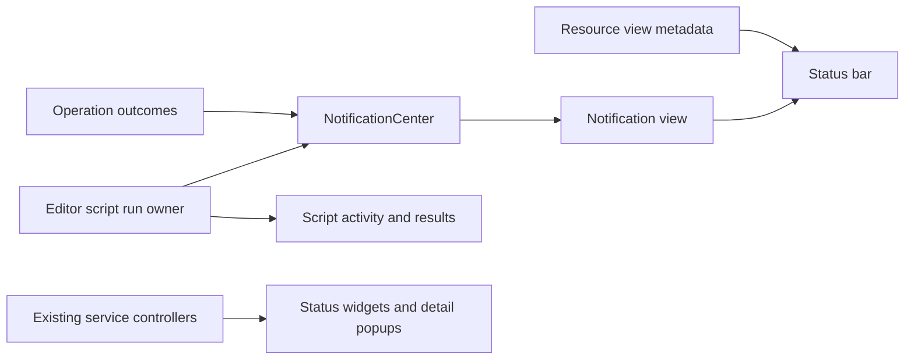

# Notifications and status plan

Status: backend implemented September 20, 2026; compact presentation revision September 21, 2026. MCP enable/disable and index rebuilding are included. Game connection controls remain a separate follow-up. The script-run owner is `EditorScriptRunService`.

## Decision

Replace the editor-owned message slot with application-owned notification history. Keep current service state, script activity, and resource metadata with their existing owners. Make the status bar display those values without interpreting one as another.

The underlying Game, MCP, index, and debugger controllers already provide useful state. They do not need a common replacement controller. The structural problems are the mixed-purpose editor message model, editor-owned script result observation, and several incomplete popup presentations.

Companion currently allows one main window per application. Application ownership is needed for startup events, closed tabs, and project changes. This plan adds no multi-window coordination.

## Current implementation and removal inventory

Paths below are relative to `companion/src/main/java/com/github/minecraft_ta/totalDebugCompanion/`.

| Current code | Finding | Treatment |
| --- | --- | --- |
| `ui/components/global/BottomInformationBar.java` | 67-line mutable model with five styles, despite its widget name. Outcomes, progress, and metadata overwrite the same value. | Delete the class and all five setter APIs. No compatibility facade. |
| `ApplicationStatusBar.setEditor` / `setEditorStatus` | Subscribes only to the selected editor, replays its last message, and chooses severity/progress icons from that mixed value. | Remove notification subscription and style dispatch. Preserve breadcrumb/caret/AST handling. |
| `AbstractTextViewPanel` | Allocates a message model for every text editor and exposes it to consumers. | Remove the field, constructor injection, and getter. |
| `IEditorPanel`, `ScriptView`, `CodeView`, `ResourceView` | Expose or forward `getInformationBar`. | Remove this contract. Replace only the resource metadata use with a small, accurately named text subscription. |
| `NavigationService.reportNavigationFailure` | Reports an error as information, or drops it when no editor is selected. Other navigation failures use a modal. | Publish navigation outcomes through the same notification center, preserving cancellation and stale-context guards. |
| `ResourceViewPanel` | Loading and failure already appear inside the resource view, with Retry on failure. The bottom message repeats them. | Delete both duplicate bottom writes. Keep inline Loading/error/Retry and resource disposal checks. |
| `ScriptPanel` | Receives execution results directly, owns the run identifier, and mixes run phase with unrelated feedback. | Move run observation out of the panel. Keep result rendering, diagnostics, and source editing in the panel. |
| `ServiceStatusWidget`, `ApplicationStatusBar.showTaskPopup`, `MainWindow.showDebuggerMenu` | Generic readonly textboxes and oversized buttons obscure small amounts of status information. | Delete `StatusDetailsPanel`. Use plain labels, compact icon/link actions, and normal debugger menu items. Share only control styling and spacing. |
| `ApplicationStatusBar.taskCards` | Active indexing replaces the clickable state button with an unclickable progress panel. | Use one interactive index widget in every phase, with progress inside it. |

The current producer inventory has **28 writes**: 22 outcomes, four activity updates, and two metadata updates. Of those, resource loading and its duplicate failure message can disappear outright. The remaining outcomes belong to notification producers; the script phase writes become run state; text/image metadata stays local.

This is a replacement of a small central model and its distributed responsibilities, not a deletion of a large unused subsystem. History and usable controls add functionality, so a net reduction in total lines is not promised. Count removed APIs and duplicate behavior, then review the actual diff size after each slice.

## Ownership and data flow

### Notification center

Add one concrete `NotificationCenter` under a `notification` package, owned and closed by `CompanionApplication`. Pass the same instance to `MainWindow` and through the existing `EditorContext` to editor actions. Navigation already has access to that context. Do not add forwarding publication methods to `CompanionUi`, a global singleton, an event bus, or separate publisher/repository/service layers.

The center owns ordering, bounded retention, read state, and dismissal. It has no Swing dependency. A notification contains:

- An application-local identifier and occurrence time.
- Severity: information, success, warning, or error.
- A short message and optional plain-text details.
- Captured source context: source label, optional project ID/directory, and optional existing `NavigationTarget`. Runtime destinations also carry the originating runtime signature.

Store immutable values. Do not retain editor instances, `ProjectScope`, native runtime bindings, exception object graphs, or callbacks that capture them. Format exceptions into bounded detail text at publication; retain full exceptions in existing logs where appropriate.

Start with a session-only limit of 100 entries and a 16,384-character limit for each message/detail string. These are bounded-storage defaults, not new user settings. Truncation must be explicit. Evict the oldest retained entry deterministically. Clearing history does not cancel work or alter live service state.

Publication must be safe before a window exists and from worker threads. Serialize center mutations, expose immutable snapshots with a monotonically increasing revision, and notify subscribers outside the center lock. The Swing subscriber applies snapshots on the EDT and rejects older revisions or updates after disposal. Subscription must atomically establish its initial snapshot and subsequent updates so startup/publication races cannot lose events.

### Editor metadata

Text encoding/size and image dimensions/zoom are metadata, not notifications. Keep one small text-only observable value on the resource view. Text/image child views update it. `IEditorPanel` may expose a default-empty metadata subscription; Java editors no longer allocate a status model just to publish messages. Reuse an existing property-change mechanism if suitable rather than introducing another listener framework.

Resource Loading/error/Retry stays inside the resource pane. Do not copy it into history merely because it used to write the bottom slot.

### Script runs

History must survive closing a tab. Run observation needs its own lifecycle to make that guarantee meaningful for results that arrive after closure.

Current behavior requests cancellation when `ScriptPanel` loses its parent, then unsubscribes results on disposal. Preserve cancellation on actual tab closure, but move it into explicit disposal rather than the save-related hierarchy listener. Temporary component reparenting must not stop a script.

Add a small application-owned `EditorScriptRunService` alongside the existing script services, with nested handle/state types. Its concrete job is to own editor-originated run IDs, observe compiler/transport outcomes, publish terminal notifications, and expose a run handle to the editor. This earns a separate class because `ScriptExecutionService` also serves MCP jobs and expression evaluation, which already own their result lifecycles and must remain silent in desktop history.

- Continue using `ScriptExecutionService` for authenticated submission and stopping. Do not duplicate compilation, transport, or project-admission logic.
- Register a run before submission; immediate compilation failure must use the same terminal path as later transport results.
- Allocate a fresh ID for each editor run within the existing editor range below 1,000,000,000. Keep MCP's negative IDs and snippets' high positive IDs separate; fail explicitly on exhaustion rather than wrap.
- The handle exposes current phase and observation while open. `ScriptPanel` uses it for buttons, progress, and result rendering; it no longer subscribes directly to all session results.
- Use one terminal transition to publish and release registration. Duplicate or late results must not finish a newer run or create duplicate notifications.
- On panel disposal, detach its observer and request stop. The application observer remains until terminal completion or connection/project invalidation. Do not retain disposed panels or full result trees in history.
- A stop request means cancellation is pending, not that execution has stopped. Unexpected disconnect reports that completion could not be confirmed. Deliberate project retirement/shutdown releases observation without manufacturing run failures.
- Carry enough local stop intent to avoid presenting confirmed cancellation as compilation failure. If the current wire result cannot distinguish cancellation from a real failure, retain the factual result rather than infer it from message text; do not change the protocol merely for notification wording.
- Application close removes the session listener and releases all remaining observations. Run notifications cannot leak across project ownership changes.

This class replaces the panel's correlation/lifecycle code. It is not a general background-job framework. MCP jobs, snippet evaluation, and the evaluator/compiled Code architecture remain unchanged.

The status bar subscribes directly to this owner's active-run snapshot. Show the script name and phase for one run, or a compact count for several. Its activity popup lists those runs with their current phase and Stop action. A run disappears on its terminal transition; its outcome remains in notification history. Do not recreate an editor-local progress/message interface to feed the bar.

## Notification behavior

Use a compact, focusable notification button in the status bar with an icon and width-bounded message preview. Keep the unread count in its accessible description. Keep active script progress and resource metadata separate so an error or format result cannot overwrite them.

The button opens bounded history with occurrence time, source, and message. Expand a row to show plain-text details and inline Open source/Copy details actions. Dismiss belongs to that row; Clear history is a small header icon. No selected-detail textbox or global action strip. Clear history needs no confirmation. Enter/Space opens the popup, Escape closes it, and keyboard focus is visible. Render external text literally, including HTML-like markup. Keep row controls stable during unrelated publications.

History has no expiry timer:

- The preview chooses the newest unread warning/error, otherwise the newest unread information/success.
- Opening history acknowledges only the entries actually presented as visible. Selecting an entry acknowledges it. Merely changing tabs does not acknowledge anything.
- New events arriving while history is open remain unread until displayed. Use captured IDs, not a global "mark everything read" operation that could swallow concurrent arrivals.
- After acknowledgement, the preview falls back to another unread event or the icon alone. Read events remain in history until dismissed, cleared, or evicted.
- A notification never steals focus or opens a modal by itself.

New warning/error notifications may show one compact balloon above the status bar. Routine outcomes stay in the bar. Outcomes already displayed by the visible script editor do not create duplicate balloons. Opening history suppresses balloons; replaying or updating history does not show them again. The balloon contains a bounded summary, Show details, and a dismiss icon. It expires after ten seconds, pauses while hovered, and never deletes its history entry. Theme changes, window resizing, disposal, and removal of the underlying entry dismiss it.

Keep success messages for deliberate operations that need confirmation, such as running or formatting a script. Do not publish autosave successes, every connection heartbeat, every index phase, or every debugger step. A format operation with no edits should report "Already formatted" rather than a misleading applied-edits count.

Repeated autosave failure is one outstanding failure per project/file. The save owner retains the notification ID for that failure episode and updates that entry while failures continue. An update does not make an acknowledged entry unread again. If the entry was dismissed, cleared, or evicted, further updates do nothing; do not recreate it on the next save retry. Successful saving ends that episode and clears the retained ID, so a later failure can create a new entry. User-triggered repeat operations remain separate events. This needs an update-by-ID operation, not a generic deduplication registry or matching on message text.

### Contextual actions

Initially support Open source through the existing `NavigationTarget`. Copy and Dismiss are presentation operations, not stored callbacks.

Resolve Open source against the active project and runtime when the popup renders and again when clicked. Do not switch projects automatically. Old-project messages remain readable; unavailable actions have a concrete reason. For local files, this action opens the current file at the recorded path. Disable it when that path no longer exists; do not guess a renamed destination. Path reuse can mean the file now has different contents, so this action does not promise the original source version. This slice does not add durable file identity or historical source snapshots.

Do not offer Show Results for a closed editor: result views currently die with the panel. Notification details retain the useful failure summary, and source navigation may reopen the file. Durable execution result history would be a separate feature.

Service recovery stays in the corresponding live status popup. This avoids retaining stale Retry/Attach callbacks inside historical entries. A later explicit notification action can open that popup if useful, without defining a generic command registry.

## What becomes a notification

| Situation | Presentation |
| --- | --- |
| Script compilation/run outcome, submission failure, formatting result | Notification with script source; keep detailed run output/Problems in the editor. |
| Navigation or code-insight operation unavailable/failed | Information for a valid empty/unavailable result; error for a failed operation. Publish even with no selected editor. |
| Resource loading or resource load failure | Existing inline Loading/error/Retry. No duplicate notification. |
| Invalid or duplicate name while creating/renaming | Existing inline validation in the name popup. |
| Asynchronous file operation/project operation failure after the initiating popup has closed | Notification with relevant source/project. |
| Autosave failure | One outstanding notification. Preserve the Boolean save result completing `false` and `saveTail`/`pendingSave()` completing exceptionally. Remove modal blocking, not failure propagation. |
| Save failure that prevents exit, discard/delete confirmation, debugger value input | Keep the blocking decision/validation in its owning dialog. Do not replace safety-critical decisions with history. |
| Unexpected MCP startup/index/debugger operation failure | One notification at the operation owner plus current failure state in its status popup. Do not infer events from rendered status text. |
| Routine connected/disconnected state, index progress, debugger phases | Live status only. Normal project switching and shutdown must not generate failure noise. |

There are seven current `showMessageDialog` call sites, two input-dialog sites, and two confirmation sites. Audit them by the table above. Do not mechanically replace every dialog. In particular, `MainWindow.showError` serves blocking exit/state-save failures as well as ordinary action failures; migrate the individual nonblocking callers rather than change its meaning globally.

## Service popup work

Keep `ServiceStatus`, `RuntimeIndexService.Status`, `DebuggerSessionController`, and `DebuggerActions` authoritative. `PopupElements` shares labels, links, icon buttons, and spacing. Each popup owns its content and actions; no universal service/action model or generic detail panel.

| Control | First usable popup | Subsequent controls |
| --- | --- | --- |
| Game | Connected instance name and copyable game directory. | Icon-only Reconnect uses the application-owned connection lifecycle. See the [current interaction review](STATUS_UI_INTERACTION_REVIEW.md). |
| MCP | Enable MCP server checkbox, copyable endpoint, compact pending/failure text. Startup and shutdown serialize on a dedicated lifecycle worker, since HTTP requests can depend on the project worker. | No port configuration. Disabling does not cancel scripts already submitted to Minecraft. The application owns the job service independently of HTTP. Running-job tracking and IDs survive server restarts, and project retirement can cancel jobs while HTTP is disabled. |
| Index | Always clickable. Show measured class count and elapsed duration, distinguishing Indexed from Loaded. Refresh rebuilds a ready index while bypassing its cache; the old binding stays usable until a validated replacement is installed. Runtime rebuilds do not fall back to local scanning. Failed-state Retry preserves valid fallback browsing, and EMPTY permits rescanning after adding mods. Busy controls are disabled. | No percentage or Cancel until supported by the service. |
| Debugger | Plain target/phase label and relevant attach/detach/resume/step actions. Show Debugger and breakpoint actions remain normal menu items. | No generic textbox or Copy details panel. |

An open popup reflects current state and re-evaluates action availability. Updates preserve keyboard focus whenever the corresponding content is unchanged. Constrain popup width/height, wrap or scroll long details, and keep Copy available for full notification details. No explanatory filler beneath headings. Index metrics are captured on the worker before the native snapshot is handed to the application.

## Implementation sequence

1. **Notification model and non-run producers.** Implement center, app wiring, notification view, navigation/code-insight/format outcomes, and targeted nonblocking action failures. Test history and startup/lifecycle races. Within this slice, remove the replaced producer calls rather than maintain dual publication.
2. **Script lifecycle and final old-model removal.** Move editor run observation into `EditorScriptRunService`, preserve cancel-on-close explicitly, migrate run feedback, retain resource metadata through the small dedicated contract, and delete `BottomInformationBar` and all getters/styles/constructor plumbing. Finish save-failure deduplication without changing close protection. At this point no old notification path remains.
3. **Compact presentation.** Replace the generic detail panels with approved purpose-specific content, expandable notification rows, and selective balloons. Wire MCP toggle and actual index rebuild; verify lifecycle and visual updates.
4. **Debugger presentation.** Use plain status and existing menu actions, with phase-dependent availability.
5. **Game connection controls.** Coordinate with the separate connection plan without introducing another connection owner here.

Audit each slice before committing it. Keep intermediate commits explicit about any remaining old model; do not call the notification migration complete before slice 2 removes it. No temporary forwarding adapters or parallel history implementations.

## Verification and acceptance

Use Java 21 and `:companion:test`. Tests should exercise public behavior with fake session/compiler boundaries and the existing Swing test utilities; no real game or listening MCP server is required for model tests.

| Area | Required cases |
| --- | --- |
| History | Publish before window creation; concurrent ordered publications; subscribe during publication; read/dismiss/clear races; bounded eviction; detail truncation; repeated autosave failure/recovery; dismiss/clear/evict during ongoing failure without resurrecting it; shutdown rejects late UI delivery. |
| Ownership | Switch tabs without replaying events; close source tab without losing history; no-editor navigation failure; switch project; replace runtime; delete/rename source; path reuse follows the documented current-file semantics; stale action clicked after popup opens. |
| Runs | Immediate compiler rejection; accepted compile failure; running/success/exception; duplicate terminal result; late result from prior run; format while running; two editors running; close while compiling/running; stop pending; disconnect; project retirement; shutdown; MCP/snippet execution produces no desktop run notifications. |
| Save safety | Boolean result completes false and pending save completes exceptionally without a modal deadlock; failed pending save still blocks move/rename/delete; retry succeeds; repeated autosave fails once in history; close/discard/exit still protect unsaved work. |
| Presentation | Long and multiline details, literal HTML-like strings, narrow window, both themes, scaling, keyboard focus, Copy correctness, notification arriving while popup is open, no empty intermediate render between updates. |
| Services | Index popup usable in every phase; Retry permission changes while open; MCP endpoint absent/present/failed; debugger action availability by phase; status replay creates no new notification. |
| Cleanup | No production reference to `BottomInformationBar` or `getInformationBar`; no notification state in `AbstractTextViewPanel`; no raw session result subscription in `ScriptPanel`; no disabled menu-item status text in the migrated popups. |

After focused tests pass, run the complete Companion suite once for the combined work. Since the shared execution service remains a dependency of MCP and snippets, include their existing tests even if their production code is unchanged. No protocol changes or mod changes are planned; if that boundary changes, check both consumers before proceeding.

Capture offscreen previews of the populated status bar, notification history, and each migrated popup. Finally verify real typing, running, switching tabs, closing a running tab, and copying details in a live Companion session. Automated checks alone do not establish that popup sizing, focus, or status-bar movement feels correct.

Completion means all migrated outcomes use one center, activities cannot be overwritten by notifications, no disposed editor is required to finish run observation, old message plumbing is gone, and the planned tests and visual checks have passed. Persistence, OS toasts, notification preferences, global background-job management, and durable run-result history are outside this work.

## Local verification record

- Full Companion runs and focused regression checks passed; the PR records the latest totals. Production/test compilation passed. The earlier mod launch-contract check remains valid; this revision changes no mod or shared protocol code.
- Focused checks cover real compilation with controlled protocol-result delivery, cancellation, duplicate/late results, closed observers, disconnect and retirement, save-failure propagation, notification retention and source-click races. Dark/light status, history, debugger, and balloon views were rendered from actual Swing components and inspected in the main-window layout. Added cases cover MCP shutdown while project work is blocked, forced index rebuild/ownership replacement, reconnect metrics, long text, and no-project debugger access.
- Standards and lifecycle/specification audits completed, and their findings were addressed. GitHub review is the next gate. The prior review findings about local-directory identity and no-project debugger access were addressed.
- One earlier full-suite attempt crashed inside the published JIndex native library during a code-insight query. The narrowed indexed-insight checks and subsequent full suite passed. The cause was not established; no speculative dependency or index-lifecycle change was made. The local crash report is retained in `companion/build/notifications-native-crash.log`.
- No fresh Minecraft execution session was used for this slice. Script execution tests use the real compiler and controlled transport results. Game connection controls remain follow-up work.

- One intermediate full-suite run timed out in the pre-existing save/undo timing test. Its focused run and the final full suite passed. No save-code change was made without a reproducible cause.

- Automatic review follow-up added regression coverage for LOCAL/RUNTIME cache-write failures retaining the old binding, empty-project rescanning, renamed game identity, and late results across MCP restarts. The missing-inventory and copy-press guards have focused regression coverage.

- MCP job ownership is independent of the HTTP server. Sequential and overlapping disable/project-switch tests verify real cancellation requests; restarting HTTP keeps the same job owner and distinct script IDs. Standalone server tests close their borrowed job service explicitly.
